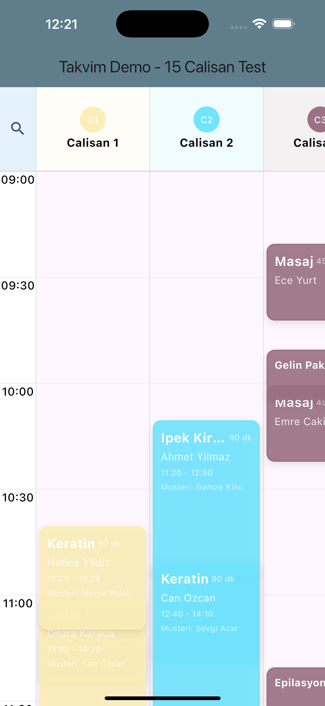
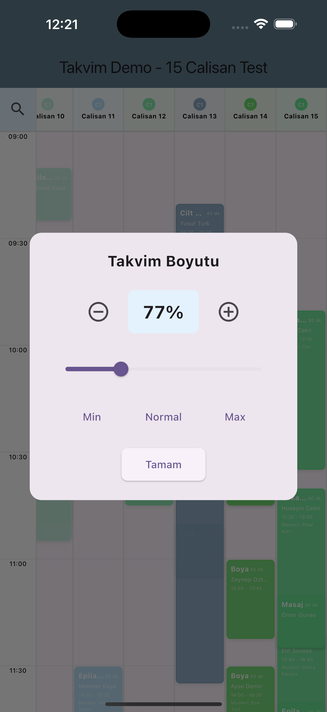
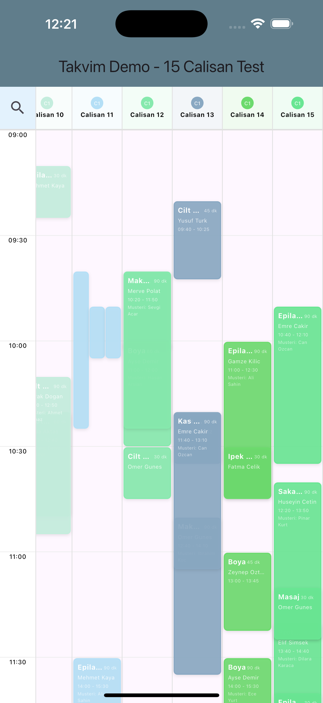

# Flutter Calendar Widget (Takvim)

A powerful and customizable calendar widget for Flutter with employee scheduling, appointment management, and advanced features.

## ✨ Features

- 📅 **Multi-Employee Calendar View** - Display schedules for multiple employees side by side
- ⚡ **Custom Appointment Durations** - Support for appointments of any length (15 min, 30 min, 1 hour, etc.)
- 🔍 **Zoom Functionality** - Adjustable zoom level from 30% to 200% for better viewing
- 📱 **Responsive Design** - All dimensions scale based on screen size and zoom level
- 🎨 **Customizable Colors** - Each employee and appointment can have custom colors
- 👆 **Interactive** - Tap on appointments or empty cells for custom actions
- 🔄 **Overlap Detection** - Automatically detects and displays overlapping appointments side by side
- 🌍 **Localization Support** - Fully customizable text for internationalization
- 📊 **Scroll Synchronization** - Header and time column stay synchronized while scrolling

## 📸 Screenshots

### Main Calendar View



_Calendar showing multiple employees with appointments in different time slots_

### Zoom Dialog



_Adjustable zoom control with slider (30% - 200%)_

### Overlapping Appointments



_Appointments that overlap in time are automatically displayed side by side_

## 🚀 Getting Started

### Installation

Add this to your package's `pubspec.yaml` file:

```yaml
dependencies:
  flutter:
    sdk: flutter
```

### Basic Usage

```dart
import 'package:takvim_yeni/calendar/calendar_view.dart';
import 'package:takvim_yeni/calendar/models/calendar_appointment_model.dart';
import 'package:takvim_yeni/calendar/models/calendar_employee_model.dart';
import 'package:takvim_yeni/calendar/models/calendar_settings_model.dart';

CalendarView(
  employeeList: [
    CalenderEmployee(
      name: 'John',
      surname: 'Doe',
      overlayColor: Colors.blue,
      appointments: [
        CalendarAppointment(
          title: 'Haircut',
          description: 'Customer: Jane Smith',
          startTime: DateTime(2025, 11, 13, 10, 0),
          endTime: DateTime(2025, 11, 13, 11, 0),
          cardBackgroundColor: Colors.blue,
          cardTextColor: Colors.white,
        ),
      ],
    ),
  ],
  calendarSettings: CalendarSettings(
    zoomDialogTitle: 'Calendar Size',
    zoomDialogMinButton: 'Min (30%)',
    zoomDialogNormalButton: 'Normal (100%)',
    zoomDialogMaxButton: 'Max (200%)',
    zoomDialogOkButton: 'OK',
    zoomTooltip: 'Adjust Size',
    closedText: 'Closed',
  ),
  onTapCell: (employee, dateTime) {
    print('Tapped empty cell: ${employee.name} at $dateTime');
  },
)
```

## 🎨 Customization

### Calendar Settings

```dart
CalendarSettings(
  zoomDialogTitle: 'Calendar Size',      // Zoom dialog title
  zoomDialogMinButton: 'Min',             // Min zoom button text
  zoomDialogNormalButton: 'Normal',       // Normal zoom button text
  zoomDialogMaxButton: 'Max',             // Max zoom button text
  zoomDialogOkButton: 'OK',               // OK button text
  zoomTooltip: 'Adjust Size',             // Zoom icon tooltip
  closedText: 'Closed',                   // Text for closed days
)
```

### Appointment Model

```dart
CalendarAppointment(
  title: 'Service Name',                  // Appointment title
  description: 'Details',                 // Appointment description
  startTime: DateTime(...),               // Start time
  endTime: DateTime(...),                 // End time
  customerFullName: 'Customer Name',      // Customer name (optional)
  cardBackgroundColor: Colors.blue,       // Card background color
  cardTextColor: Colors.white,            // Card text color
  extraData: customObject,                // Store any custom data
  onTap: () {},                           // Custom tap handler
)
```

### Employee Model

```dart
CalenderEmployee(
  name: 'First Name',                     // Employee first name
  surname: 'Last Name',                   // Employee last name
  overlayColor: Colors.blue,              // Employee color theme
  profileImageUrl: 'url',                 // Profile image (optional)
  appointments: [...],                    // List of appointments
  allDayClosed: false,                    // Mark employee as unavailable
)
```

## 🔧 Advanced Features

### Overlap Detection Algorithm

The calendar automatically detects overlapping appointments and displays them side by side:

- 2 overlapping appointments → Each takes 50% width
- 3 overlapping appointments → Each takes 33% width
- 4 overlapping appointments → Each takes 25% width
- And so on...

### Zoom Levels

- **Minimum:** 30% - Compact view for seeing more employees
- **Normal:** 100% - Default comfortable view
- **Maximum:** 200% - Detailed view for better readability

### Responsive Design

All dimensions are calculated as percentages of screen size and scale with zoom:

- Hour height: 8% of screen height (scaled by zoom)
- Employee column width: 20% of screen width (scaled by zoom)
- Font sizes: Responsive to both screen size and zoom level

## 📝 Example

Check out the complete example in `/lib/home_page.dart`:

- 15 employees with random appointments
- Various appointment durations (30, 45, 60, 90 minutes)
- Overlapping appointment handling
- Interactive tap handlers

## 🤝 Contributing

Contributions are welcome! Please feel free to submit a Pull Request.

## 📄 License

This project is licensed under the MIT License.

## 🐛 Issues

If you encounter any issues, please report them on the GitHub issues page.

```

```
